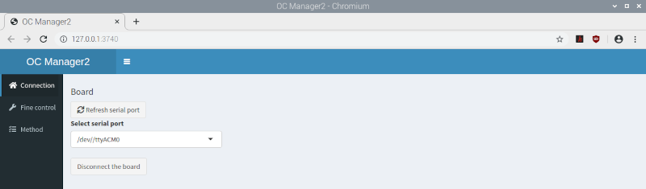

# OC Manager2 - Next Generation Office Chromatography



The next generation [OCLab2](https://github.com/OfficeChromatography/oclab2) was accompagnied by new software, OC Manager2, completely restructured and newly written in R supported by Python.

## Installation

To install the software, prepare a Raspberry Pi 4B (4 GB RAM) with Raspberry Pi OS with Desktop (https://www.raspberrypi.org/downloads)

Open the Raspberry-Pi configuration and select the tab 'Interfaces'. <br />
Enable: Camera, SSH, VNC, I2C, Serial Port, Remote GPIO. <br/>
Select the tab 'Performance' and increase GPU Memory to 512 MB. <br />
Click Okay and reboot.

### Problems with time server

You may run into problems, if date and time is not correctly synchronized, hindering the OS update and further installations.
In this case, activate the debian time server (uncomment the line) or select a proper time server working for you. <br />

Therefore open the timesyncd.conf

```
sudo nano /etc/systemd/timesyncd.conf
```
[Time]<br />
#NTP=<br />
#FallbackNTP=0.debian.pool.ntp.org 1.debian.pool.ntp.org 2.debian.pool.ntp.org $ <br />
#FallbackNTP=[your time server]

followed by

```
sudo timedatectl set-ntp true
sudo reboot
```

Then wait until date and time is correctly synchronized, continuing with

```
sudo apt-get update
sudo apt-get upgrade
```

### Software installation

To install the OC_manager2 software, open a terminal on the Raspberry Pi (being in /home/pi) and run the following command:

```
git clone https://github.com/OfficeChromatography/oc_manager2.git
```

Open the file ```/home/pi/OC_manager2/sudo_bash.txt```, copy the single line (for the desktop or lite version) and paste it into the terminal, for example:

```
sudo bash OC_manager2/oc_manager_install_desktop.sh |& tee oc-install.txt
```

followed by ENTER.<br />

The install script will install all necessary libraries and software packages, followed by a reboot. <br />
In case of problems, consult the logfile ```/home/pi/oc-install.txt```, 
and also consult the README_R_packages_versions file cloned with OC_manager2.

### Ready prepared image file

Alternatively, you can download an image (2.3 GB) of Raspberry Pi OS with Desktop together 
with the OC_manager2 set-up, following 
[this link](https://jlubox.uni-giessen.de/dl/fi56jQAHvpw5iWSrXFQaA49v/OC_manager2_desktop.img.gz).<br /> 
If you prefer to use the Raspberry OS lite (no desktop), you can find the respective image 
(1.1 GB) [here](https://jlubox.uni-giessen.de/dl/fiTNMzoM6dDYT9CTq1DJQVME/OC_manager2_lite.img.gz).<br />

Using the ‘Raspberry Pi Imager‘ (https://www.raspberrypi.org/downloads), flash the image onto an SD card (>= 16 BG) and boot the Raspberry Pi.
User = pi; password = oc_lab2.
Open the Raspberry Pi configuration to select your settings in the 'Localisation' tab.<br />
Perform an OS upgrade with

```
sudo apt-get update
sudo apt-get upgrade
```

and reboot.

### Static IP adress

It is recommended to set a static IP adress on the Raspberry Pi by running the following command in a terminal

```
sudo nano /etc/dhcpcd.conf
```

and filling out the following lines:<br />
	interface eth0 (or eth1 using the USB hub for LAN connection)<br />
	static ip_address=<br/>
	static routers=<br />
	static domain_name_servers=<br />

Save the changes with Ctrl+O, and close the file with Ctrl+X.
 
Then you can directly access the OC_manager2 through a browser from any PC/notebook in your network by typing the IP adress in the adress field.<br />

Therefore, however, you have to enable a Crontab job, accessed by:

```
sudo crontab -e

```
Once in the editor, add this line, which will launch the application at reboot: 

```
@reboot Rscript /home/pi/OC_manager2/app_exec.R
```

Save the changes with Ctrl+O, and leave the editor with Ctrl+X.

### Opening the OC Manager2 at the Raspberry Pi
After reboot, the OC Manager2 will be available in the browser at http://127.0.0.1 (localhost), if the Crontab job was configured respectively. <br />
Therefore, best configure the browser to start with the custom URL http://127.0.0.1 <br />

#### Directly from R (in case of problems to catch the errors)

Being in a terminal at pi/home, type the following commands 

```
cd OC_manager2
R
shiny::runApp()
```


### Documentation

On how to use the software, a pdf is available in the downloaded folder ```OC_manager2/Instructions```.

